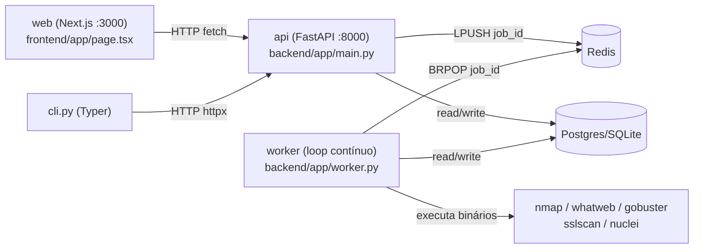
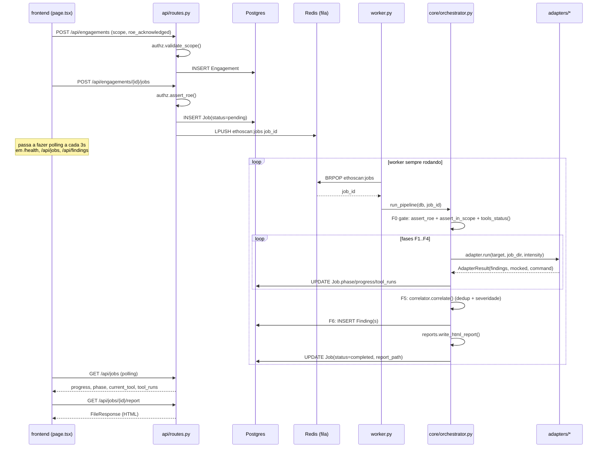

# Arquitetura — fluxo e "quem chama quem"

Este documento existe para responder uma pergunta específica: **quando algo acontece na
UI, qual código roda, em que ordem, e em que processo?** Para setup/instalação, ver o
[README](../README.md) e [docs/kali-setup.md](kali-setup.md).

## Processos

O sistema roda como 4 processos independentes (ver [docker-compose.yml](../docker-compose.yml)),
que só se falam via **Postgres** (estado) e **Redis** (fila + flags de cancelamento).
Não há chamada de função direta entre eles.



**Ponto que mais confunde:** a API **nunca executa scans**. `POST /api/engagements/{id}/jobs`
só cria uma linha `Job(status=pending)` no banco e dá `LPUSH` no Redis. Quem de fato roda o
pipeline é o `worker`, que é outro processo (`python -m app.worker`), lendo a fila com `BRPOP`.
Se o worker não estiver de pé, o job fica parado em `pending` para sempre — a API não vai
reclamar disso além do `/health` mostrar `redis_ok`.

## Sequência: criar engagement → rodar pipeline → ver relatório



## Fases do pipeline (F0–F6)

Definidas em `PHASES` / `PHASE_LABELS` em
[core/orchestrator.py](../backend/app/core/orchestrator.py):

| Fase | Nome | Tools | O que faz |
|------|------|-------|-----------|
| F0 | gate | — | `assert_roe`, `assert_in_scope` para cada alvo, `tools_status()` — falha aqui se faltar tool obrigatória e mock estiver desligado |
| F1 | recon | whatweb | roda o adapter, acumula `RawFinding` |
| F2 | enum | nmap, sslscan | idem |
| F3 | web-discovery | gobuster | idem |
| F4 | vuln | nuclei | idem |
| F5 | correlate | — | `correlator.correlate()`: dedup por fingerprint, mantém maior severidade |
| F6 | report | — | persiste `Finding`s no banco, gera HTML via `reports.write_html_report()`, marca job `completed` |

A cada mudança, `run_pipeline` faz `db.commit()` e grava um `AuditEvent` — é por isso que dá
para acompanhar o histórico completo de um job pela tabela `audit_events`, mesmo sem olhar logs.

## Mapa de arquivos por camada

```
frontend/app/page.tsx        UI única (sem componentes separados) — fetch direto para a API
backend/cli.py                cliente alternativo (Typer), fala com a mesma API

backend/app/main.py           monta o FastAPI app, CORS, GET /health (sem auth)
backend/app/api/routes.py     rotas /api/* (auth via X-API-Key) — CRUD fino, sem lógica de negócio
backend/app/core/security.py  dependency require_api_key
backend/app/core/authz.py     validação de escopo/RoE (usado em routes.py E dentro do pipeline)

backend/app/queue.py          wrapper Redis: enqueue_job / pop_job / cancel flags
backend/app/worker.py         processo separado: loop pop_job -> run_pipeline
backend/app/core/orchestrator.py   coração do pipeline: run_pipeline(), fases F0-F6

backend/app/adapters/base.py       BaseAdapter: decide real vs mock, RawFinding/AdapterResult
backend/app/adapters/{nmap,whatweb,gobuster,sslscan,nuclei}.py   um adapter por tool
backend/app/adapters/__init__.py   all_adapters(), tools_status() (usado por /health e F0 gate)

backend/app/core/correlator.py     dedup de findings (F5)
backend/app/core/reports.py        gera o HTML final (F6)

backend/app/db.py             engine/session SQLAlchemy, init_db()
backend/app/models.py         Engagement 1→N Job 1→N Finding, + AuditEvent
backend/app/schemas.py        Pydantic (request/response da API)
backend/app/config.py         Settings (env vars), get_settings() cacheado
```

## Onde procurar quando algo quebra

- **Job fica em `pending` para sempre** → worker não está rodando, ou Redis caiu
  (checar `GET /health` → `redis_ok`).
- **Job falha logo no início** → provavelmente F0 gate: RoE não confirmado, alvo fora do
  escopo (`core/authz.py`), ou tool em falta com `ETHOSCAN_ALLOW_MOCK=false`.
- **Finding não aparece mesmo o adapter tendo rodado** → conferir `correlator.py` (pode ter
  sido deduplicado) ou `_persist_findings` em `orchestrator.py` (fingerprint já existia).
- **Frontend mostra "mock" quando devia ser "real"** → `adapter.available()` em
  `adapters/base.py` (checa `shutil.which(binary)` no PATH do container/host do **worker**,
  não da API nem da sua máquina local).
- **Quer saber a ordem exata de execução de um job específico** → tabela `audit_events`,
  filtrando por `engagement_id`.
